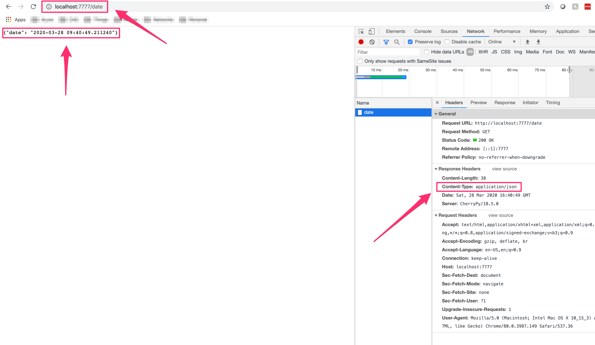

# Load Testing Project

The objective of this project was to build an "API" that returns current date/time in a JSON format. Additionally, there will be a test application which queries the "API" X times per second which will record `success`, `failure`, `and TTLB(Time to Last Byte)`.

### Different Sections
- [Instructions to run Web Application](#instructions-to-run-web-application)
- [Docker Learning](#docker-learning)
- [Python Libraries](#python-libraries)
    - [CherryPy](#cherrypy)
    - [requests](#requests)

### Instructions to run Web Application

1. Clone the repository to your local system and change directory into the project
```bash
git clone https://github.com/bqly520/load_testing_project.git
cd load_testing_project
```

2. Assuming that you already have Docker CLI installed, run the following command.
```bash
# This command will first read the docker file and build the images
# Then it will create and run two containers once they are ready
# Note: the containers will both be created into a network called 'load_testing_project_default'
docker-compose up
# Can possibly go into more details about the Dockerfile maybe...?
```

3. Once the containers are running, you can navigate to the [Date-Time Web Application](http://localhost:7777/date) and verify that the return object is of JSON format. You can validate by inspecting the page and checking to see if the `Content-Type: application/json`.


4. Let's navigate to the [Test Application](http://localhost:8888/) to begin our load testing. Please enter any valid number to query the "API" X number of times and the results will be displayed.

- `success`: The number of successful API calls
- `failure`: The number of failed calls
- `avg TTLB`: Gets the average `Time to Last Byte` of all *successful* API calls in seconds
> To re-run the query, we can either click back arrow on the browswer or modify the `numapi=#` and click *enter*

5. `Caution:` Please do not run the code seperately(by running a `docker build` for each application instead of docker-compose) because even though both applications are accessible, the test application will fail because the container name is not able to resolve via the **container name**. By default Compose sets up a single network for the applications and each container for a service joins the default network. Both containers are reachable and discoverable by container name. This capability is called `automatic service discovery`.

6. This was a very fun project and allowed me to get a deeper understanding of using Docker and Docker compose.

### Docker Learning
```bash
# Configuring and run multiple containers at the same time
docker-compose up

# Configuring and run multiple containers at the same time, and forcing to re-build all images
docker-compose up --build

# Build one or many images ONLY
docker-compose build

# Docker inspect displays loads of details on the resource
docker inspect <network> <container> <image>

# Building the docker image with a tag 'date-api'
docker build -t date-api .

# Run the docker image, -d(detaching) for running in the background
docker run -d -p 7777:7777 date-api

# List images
docker images

# Remove images
docker rmi Image Image

# List containers
docker ps -a

# Remove containers
docker rm ID_or_Name
```

#### docker-compose
This file is basically the backbone of Docker-Compose as it contains all the information needed to run the desired services. These services can pretty much be anything you want, in this example I’ll only be running a container for the app itself and another container for the test app, but you could also have other services or configure default networks.


### Python Libraries

### requests
The requests library is used for making HTTP requests in Python. It abstracts the complexities of making requests behind a beautiful, simple API so that you can focus on interacting with services and consuming data in your application.
```bash
pip install requests
```

### CherryPy
CherryPy allows developers to build web applications in much the same way they would build any other object-oriented Python program. This results in smaller source code developed in less time.
```bash
pip install CherryPy
```